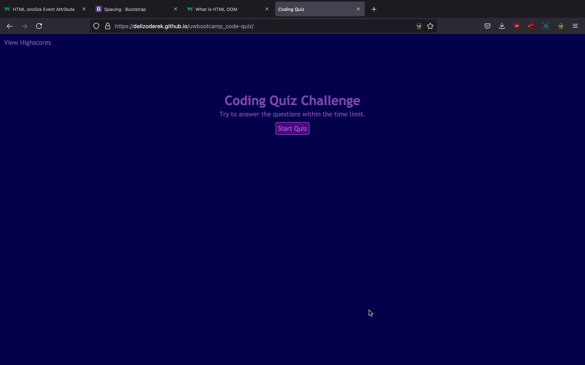
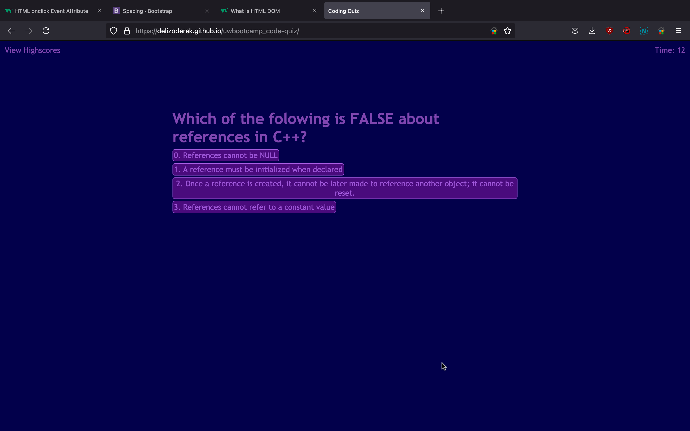
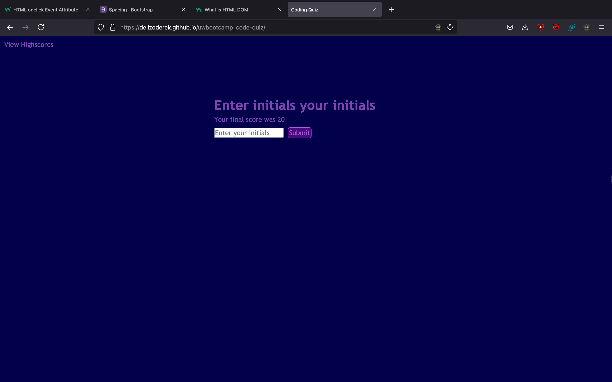
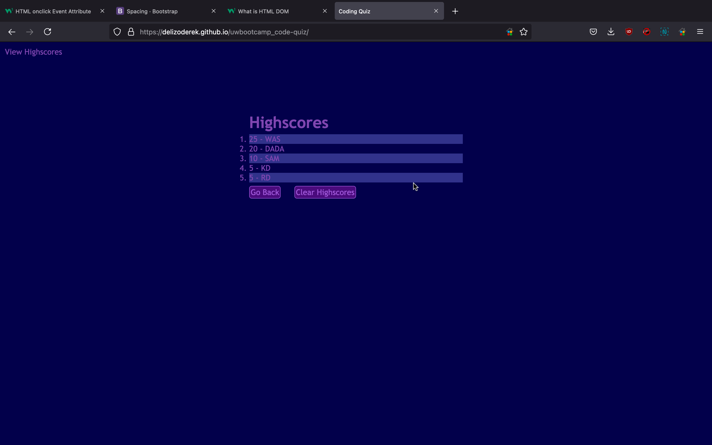
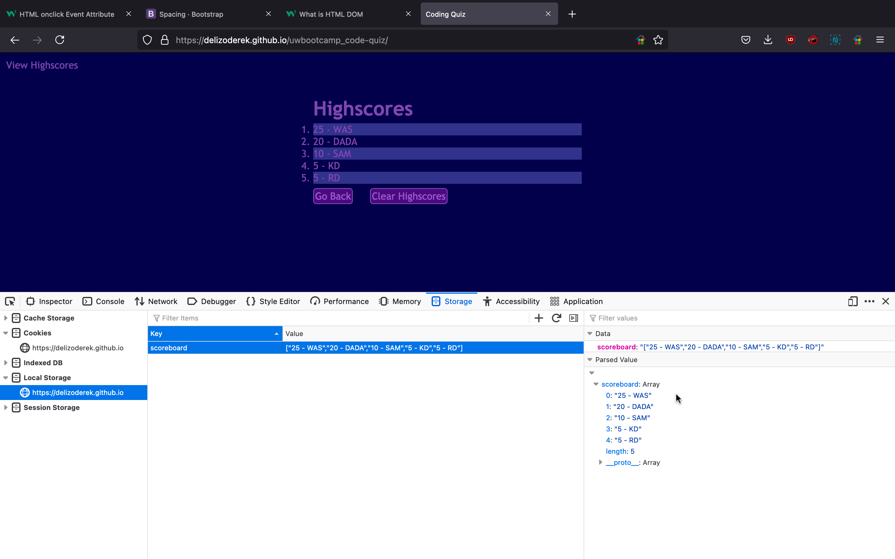

# Coding Quiz
The goal of this assignment was to manipulate the DOM of the webpage using javascript and create a coding quiz. The quiz needed to have a local scoreboard that tracked the top scoring users. The criteria for the assignment is outlined [here](./assets/AssignmentCriteria.md).

# What I did
In general, I broke the webpage up into sections. The header is static and keeps the same format no matter what content is loaded. The quiz area I broke into 3 elements. One handles the heading for the page content, which changes depending on the page that is loaded. The second, is the main holder for content elements (multiple choice answers, initials field, highscores, etc.). The third is the status box, which is primarily used for letting the user know if they got the question right or wrong. There are some cases where it is used to hold content.

# Resources
- [How to get and set CSS Variables with JavaScript](https://davidwalsh.name/css-variables-javascript)
- [String Split](https://www.w3schools.com/jsref/jsref_split.asp)
- [Even and Odd Rules](https://www.w3.org/Style/Examples/007/evenodd.en.html)
- [Custom Sort Functions for Arrays](https://developer.mozilla.org/en-US/docs/Web/JavaScript/Reference/Global_Objects/Array/sort)

# Completed Application
[Coding Quiz Application](https://delizoderek.github.io/uwbootcamp_code-quiz/)

